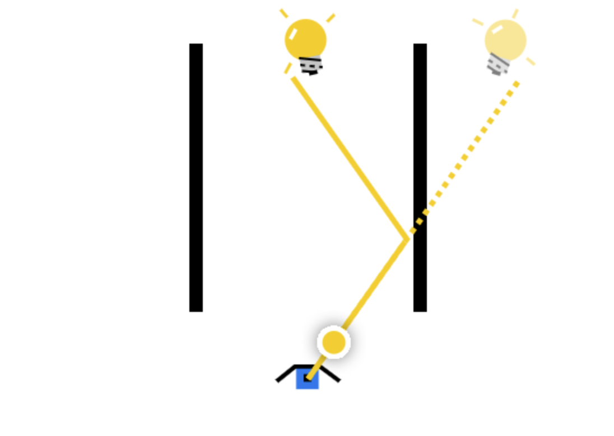

# Interactive Exploration - Light Reflections

This small interactive exploration illustrates how light rays behave when reflecting. Specifically
It shows the relationship between the apparent distance of the eye's image of an object in a mirror
v.s. the distance the light ray travels to reach that object.

## Design considerations

- The object was chosen to be a lightbulb so that the user does not need to understand that all
  objects have light coming off of their surface, they just need to know lightbulbs emit light!
- The interactive has a clearly indicated and satisfying "success" state when the user
  chooses an angle that causes the light to bounce and hit the lightbulb.
- The lightbulb which appears in the mirror is vertically reflected if the number of bounces
  is odd.

## Implementation considerations

- The code was written in TypeScript for the purpose of readability and correctness.
- I aimed to write the code in a functional style. Some functions should be refactored to be shorter.
- The code is general enough that it could be extended to create an interactive with
  different controls to illustrate different aspects of the scenario.

## Try it out

[https://vezwork.github.io/brilliant-light/dist/](https://vezwork.github.io/brilliant-light/dist/).

## Building and running locally

1. Clone this repo to the folder of your choice.
2. Navigate to that folder in your terminal.
3. Run `npm install`.
4. Run `npm run dev`. This terminal window will now use Webpack to watch for any changes to files in
`./src`. If you change a file, the project will automatically rebuild.
5. Open the folder in your file explorer.
6. Navigate to `./dist` and open index.html in your browser.
